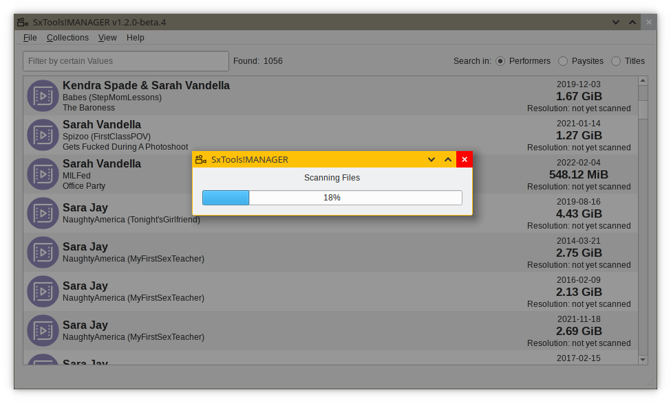
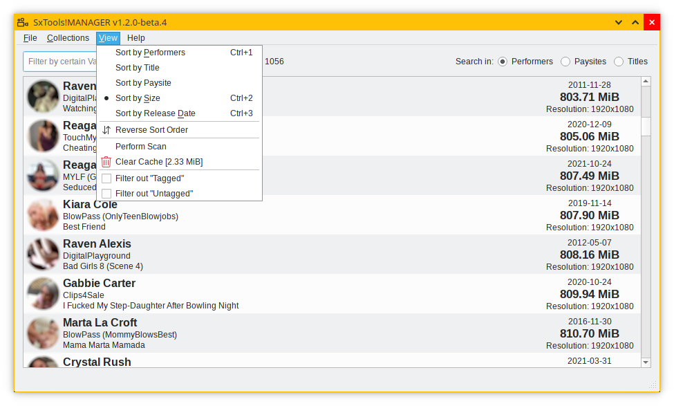
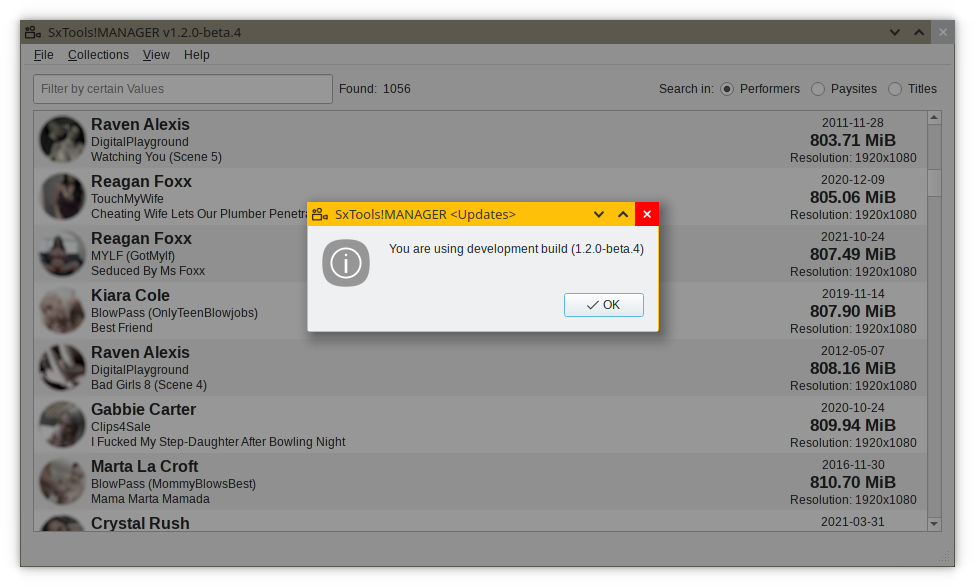
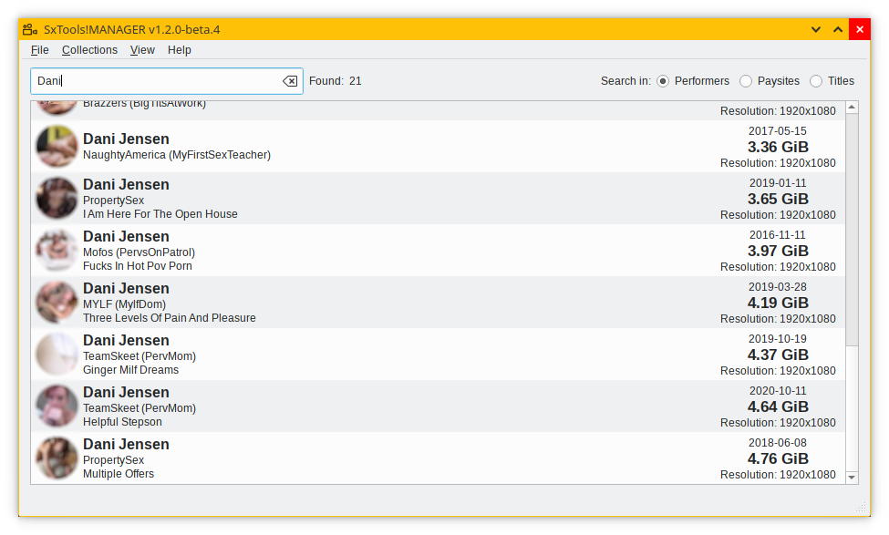
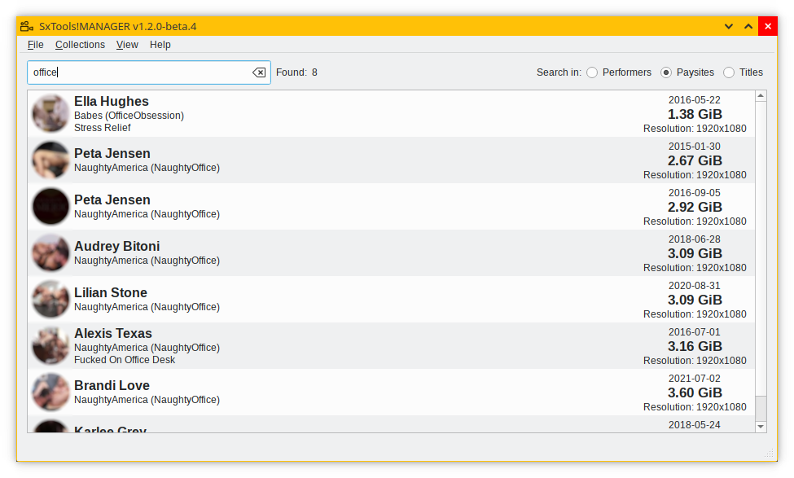

## PROJECT ##

* ID: **S**xTools!**M**ANAGER
* Contact: git@schepsen.eu

## DESCRIPTION ##

**S**xTools!**M**ANAGER helps you to manage a video collection according to your wishes

### USAGE ###

* git clone https://github.com/nschepsen/sxtools-manager.git
* cd sxtools-manager
* [OPTIONAL] python3 -m venv .env
* [OPTIONAL] source .env/bin/activate
* pip install .
* (...)
* Profit! sxtools -h | sxtools -v --qt

usage: sxtools [-h] [-v | -q] [--gui] [-n] [--input PATH] [--output PATH] [-t TOP] [-s] [--asc] [-V]

```
SxTools!MANAGER helps you to manage collections according to your wishes

optional arguments:
  -h, --help         show this help message and exit
  -v, --verbose      verbose mode: info & debug
  -q, --quiet        less output: warnings & criticals
  --gui, --qt        launch the app in windowed mode
  -n, --dry-run      run the app without taking any changes to files and the "map" library
  --input PATH       set a path to sources
  --output PATH      set a path to an output directory (default: "$input")
  -t TOP, --top TOP  limit the "in-app table size" to n rows
  -s, --scan         scan scene(s) using "ffprobe"
  --asc              sort the output in ascending order
  -V, --version      show program's version number and exit
```
### SCREENSHOTS ###







## CHANGELOG ##

### SxTools!MANAGER 1.2.0 ###

* fix typo(s) & release

### SxTools!MANAGER 1.2.0-beta.4 ###

* improve scene layout (1, 2 & 3 rows) based on existing data
* fix mimetype guessing bug
* improve thumbnail painting performance
* add SceneSortFilter(QSortFilterProxyModel)
* add additional filters: `Tagged` | `Untagged`
* add SceneDelegate(QStyledItemDelegate)::`createEditor()`

### SxTools!MANAGER 1.2.0-beta.3 ###

* add Qt6-based UI (`PySide6`) prototype
* add a method to create thumbnails, use `scan perform` action
* add `cache()` to keep scene's thumbnails in memory
* fix typo(s)
* update performer & paysite DB to the latest version

### SxTools!MANAGER 1.2.0-beta.2 ###

* add `CLI`-part console commands (:v, :q, :s, :f[ path], :a, :cl)
* add a better date parser
* add a duplicate detection method (options: `keep`, `remove` or `skip`)
* fix bug #1: 1-token-name vs. unknown performer's name starting with the same token
* fix wiping sitemap by `--dry-run` & made changes
* add `sortmap()` to keep the DB sorted
* relocate the `ffprobe`-part into its own method for performance and reuse purpose

### SxTools!MANAGER 1.2.0-beta.1 ###

* add `ffprobe` support to read out scene's metadata
* add a logger for a better debugging experience, see `~/sxtools/sxtools.log`
* pack the app as a `pip package`
* rewrite the `CLI`-part and improve its performance
* split the app in `Core`, `CLI` & `GUI` (using Qt6) modules

### SxTools!MANAGER 1.0.1 ###

* add support for different scene releases
* fix typo(s)
* update performer & publisher DB to the latest version

### SxTools!MANAGER 1.0.0 ###

* initial release
